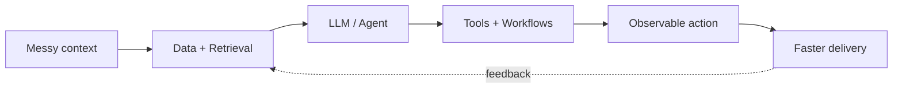

<div align="center">

# Hey, I’m Rajaram Joshi 👋

[](https://git.io/typing-svg)

### I build AI systems that help teams detect blockers, preserve context, and ship faster.

[](https://rajaram.info)
[](https://www.linkedin.com/in/rajaram-joshi/)
[](https://github.com/TheCBKM)

</div>

---

## `whoami`

```yaml
name: Rajaram Joshi
role: CTO at Scrummer AI
mode: Builder + Technical Leader
focus:
  - AI agents and LLM workflows
  - Backend platforms and data pipelines
  - DevOps, automation, and reliable delivery
currently_building: Systems that turn context into action
```

I work where **AI, backend engineering, and operations** meet—designing useful agent workflows, scalable platforms, and the delivery systems that keep them reliable in production.

## What I’m building

| | Focus | What it solves |
|---|---|---|
| 🧠 **Scrummer AI** | Engineering intelligence and AI workflows | Detects blockers, preserves team context, and helps engineers move faster |
| 🔎 **NinjaHire** | Candidate intelligence and agent workflows | Powers AI-assisted hiring workflows across **200M candidate profile records** |
| 🛠️ **Opsaway** | Freelance CTO and engineering leadership | Helps teams turn product ideas into scalable, production-ready systems |
| ⛓️ **ShopDeFi** | Backend and Web3 product engineering | Delivered as part of my work at Deqode Labs |

## My builder’s toolbox

<div align="center">


</div>

<details>
<summary><strong>🤖 AI and agent engineering</strong></summary>
<br>

- LLM application architecture, tool use, RAG, and agent orchestration
- Context-aware workflows for engineering and hiring operations
- Structured outputs, evaluations, guardrails, and production observability
- Automation that connects models with real business systems

</details>

<details>
<summary><strong>⚙️ Backend and data systems</strong></summary>
<br>

- APIs, distributed services, workflow engines, and background processing
- High-volume ingestion, retrieval, enrichment, and data pipelines
- PostgreSQL, MongoDB, Redis, caching, queues, and performance tuning
- TypeScript/Node.js, Python/FastAPI, and Go services

</details>

<details>
<summary><strong>🚀 DevOps and delivery</strong></summary>
<br>

- Dockerized workloads, CI/CD automation, and cloud infrastructure
- GitHub Actions, Linux, AWS, monitoring, and reliability practices
- Developer workflows that shorten feedback loops and improve release confidence

</details>

## How I think about systems



> The best AI workflow is not a clever demo. It is a dependable system that helps someone make a better decision or complete meaningful work.

## GitHub at a glance

<div align="center">


</div>

> [!TIP]
> Open the pinned repositories below for the code and systems I’m most excited about.

## Let’s build something useful

I’m interested in ambitious problems involving **LLMs, AI agents, developer tooling, backend platforms, data-intensive systems, and DevOps automation**.

If you are building in that space, [connect with me on LinkedIn](https://www.linkedin.com/in/rajaram-joshi/) or explore more at [rajaram.info](https://rajaram.info).

<div align="center">

### Build deeply. Automate thoughtfully. Ship reliably. ⚡

</div>
